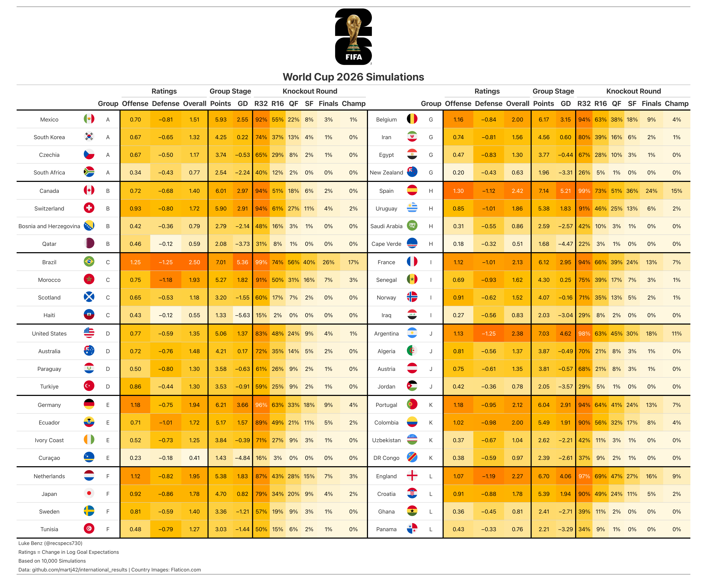
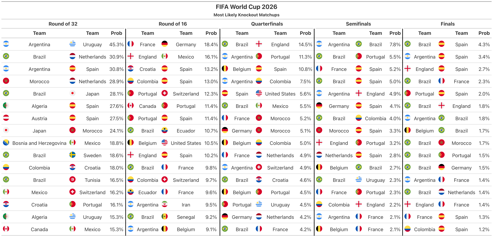

# FIFA World Cup 2026
---
Modeling, simulations, and predictions for the 2026 FIFA World Cup (USA, Canada, Mexico).

#### Blog Post
Full write-up with model details, simulation methodology, and predictions: [lukebenz.com/post/world_cup_2026](https://lukebenz.com/post/world_cup_2026/)

#### Model Script

* __fit_model.R:__ Estimates a Bayesian bivariate Poisson model using international results since 2016. For more details, see Equation (2) of [Benz and Lopez, 2021](https://arxiv.org/abs/2012.14949).

For working with the model coefficients, please check out the file __predictions/ratings.csv__, with constants

```
home_field    = 0.3652971
neutral_field = 0.2230780
mu            = -0.07715556
```

#### Simulations

* __run_sim.R:__ Run 10,000 simulations of the World Cup tournament (48 teams, 12 groups, R32 → R16 → QF → SF → Final).
* __helpers.R:__ Helper functions for simulations.
* __game_preds.R:__ Save out predictions for individual games (group stage matchweeks + knockout rounds).
* __make_table.R:__ Script for making gt tables.
* __graphics.R:__ Script for plotting tournament advancement probability over time.
* __update_scores.R:__ Scrapes live scores from ESPN and updates __data/schedule.csv__.
* __auto_update.R:__ Runs the full pipeline (scores → sims → tables → graphics) in one step.


#### Data

Match results courtesy of [Mart Jürisoo](https://github.com/martj42/international_results).

Flag figures courtesy of [Flaticon](https://www.flaticon.com/).

#### Pre-Tournament Predictions


#### Most Likely Matchups

